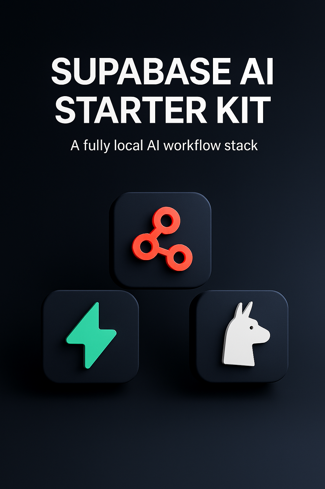

# Supabase AI Starter Kit

> **Build AI that scales. Ship in a weekend, iterate forever.**

An open-source Docker Compose template that gets you from idea to AI-powered app in minutes, not months. Built for the builders, hackers, and 100x developers who move fast and ship things.


Inspired by the [n8n AI starter kit](https://github.com/n8n-io/self-hosted-ai-starter-kit), but supercharged with Supabase's complete backend platform.

## What's included

✅ **[Supabase](https://supabase.com/)** - PostgreSQL + Auth + Realtime + Edge Functions + pgvector  
✅ **[n8n](https://n8n.io/)** - Visual workflow automation with 400+ integrations  
✅ **[Ollama](https://ollama.com/)** - Local LLMs that actually work in production  
✅ **Pre-built AI chatbots** - Ready to use, zero configuration required

## What you can build

⭐️ **AI-powered customer support** with your company docs  
⭐️ **Smart document processing** workflows that never leak data  
⭐️ **Local RAG systems** with vector search and semantic retrieval  
⭐️ **Automated content generation** pipelines for marketing teams

## Installation

The core of the Supabase AI Starter Kit is a Docker Compose file, pre-configured with network and storage settings, minimizing the need for additional installations.

### Cloning the Repository

```bash
git clone https://github.com/fletchertyler914/supabase-ai-starter-kit.git
cd supabase-ai-starter-kit
```

### Running with Docker Compose

#### For everyone else (CPU-only)

```bash
docker compose --profile cpu up
```

#### For NVIDIA GPU users

```bash
docker compose --profile gpu-nvidia up
```

> [!NOTE]
> If you have not used your NVIDIA GPU with Docker before, please follow the [Ollama Docker instructions](https://github.com/ollama/ollama/blob/main/docs/docker.md).

#### For AMD GPU users on Linux

```bash
docker compose --profile gpu-amd up
```

#### For Mac / Apple Silicon users

If you're using a Mac with an M1 or newer processor, you can't expose your GPU to the Docker instance. You have two options:

1. **Run fully on CPU** (use the "For everyone else" section above)
2. **Run Ollama locally** for faster inference (recommended)

**Option 2: Local Ollama setup:**

First, install and start Ollama locally:

```bash
# Install Ollama (check https://ollama.com/ for latest instructions)
curl -fsSL https://ollama.com/install.sh | sh

# Start Ollama and pull models
ollama serve
ollama pull llama3.2:1b
ollama pull nomic-embed-text
```

Then run the starter kit:

```bash
export OLLAMA_HOST=host.docker.internal:11434
docker compose up
```

## ⚡️ Quick start and usage

After completing the installation steps above, follow these steps to get started:

1. **Open [http://localhost:5678/](http://localhost:5678/)** in your browser to set up n8n. You'll only have to do this once.
2. **Navigate to the included workflows** - they're automatically imported and activated
3. **Click the direct chat link** to start using the AI chatbot immediately:
   - **NodeBot**: [http://localhost:5678/webhook/ba65d0a2-7d1d-4efe-9e7a-c41b1031e3bb/chat](http://localhost:5678/webhook/ba65d0a2-7d1d-4efe-9e7a-c41b1031e3bb/chat)
4. **If this is your first time**, you may need to wait while Ollama downloads the `llama3.2:1b` model. You can inspect the Docker console logs to check progress.

To open n8n at any time, visit [http://localhost:5678/](http://localhost:5678/) in your browser.

With your n8n instance, you'll have access to over 400 integrations and a suite of basic and advanced AI nodes such as [AI Agent](https://docs.n8n.io/integrations/builtin/cluster-nodes/root-nodes/n8n-nodes-langchain.agent/), [Text classifier](https://docs.n8n.io/integrations/builtin/cluster-nodes/root-nodes/n8n-nodes-langchain.text-classifier/), and [Information Extractor](https://docs.n8n.io/integrations/builtin/cluster-nodes/root-nodes/n8n-nodes-langchain.information-extractor/) nodes. To keep everything local, just remember to use the Ollama node for your language model and PostgreSQL with pgvector for embeddings.

## What you get out of the box

### 🤖 **Instant AI Chatbots**

Pre-built workflows that work immediately:

- **"NodeBot"** - A technical AI assistant pre-trained on Supabase, n8n, and Ollama workflows
- soon™️...

> ✨ **Workflows are automatically activated!**
> The chat links work immediately after startup.

> ✨ **Workflow changes auto-save!** Modify workflows in the n8n UI and they are stored in supabase under the `n8n` schema.

### ⚡ **Vector Search Ready**

PostgreSQL with pgvector extension pre-configured. No setup, no fuss:

```sql
-- Create your table
CREATE TABLE documents (
  id SERIAL PRIMARY KEY,
  content TEXT,
  embedding VECTOR(1536),
  metadata JSONB DEFAULT '{}'
);

-- Search semantically
SELECT content, cosine_similarity(embedding, '[...]'::vector) as similarity
FROM documents
ORDER BY embedding <=> '[...]'::vector
LIMIT 5;
```

### 🔐 **Auth & Realtime Built-in**

User management, real-time subscriptions, and APIs auto-generated. Because life's too short to build auth from scratch.

## Key Differentiators

| Feature                | n8n Starter Kit | Supabase AI Starter Kit                |
| ---------------------- | --------------- | -------------------------------------- |
| **Vector Storage**     | Qdrant          | PostgreSQL + pgvector                  |
| **Authentication**     | ❌              | ✅ Built-in auth with social providers |
| **Real-time Features** | ❌              | ✅ WebSocket subscriptions             |
| **Edge Functions**     | ❌              | ✅ Serverless TypeScript functions     |
| **Database Admin**     | ❌              | ✅ Supabase Studio interface           |
| **Email Testing**      | ❌              | ✅ Local email server for dev          |
| **Pre-built Chatbots** | ❌              | ✅ Working chatbot out of the box      |

## For the Tinkerers

### Local Email Testing

```bash
docker compose -f docker-compose.yml -f dev/docker-compose.dev.yml up
```

Includes local email server at [localhost:9000](http://localhost:9000) for testing OTP flows.

### Adding More Ollama Models

**Before starting containers** (add to `.env` file):

```bash
# Comma-separated list of models to pull automatically
# Default: llama3.2:1b,nomic-embed-text
OLLAMA_DEFAULT_MODELS=llama3.2:1b,nomic-embed-text,llama3.2:3b,codellama:7b
```

**After containers are running:**

```bash
# Pull additional models manually
docker exec ollama-cpu ollama pull llama3.2:3b
docker exec ollama-cpu ollama pull codellama:7b

# Or for GPU containers
docker exec ollama-gpu ollama pull llama3.2:3b

# List available models
docker exec ollama-cpu ollama list
```

## Upgrading

### For NVIDIA GPU setups:

```bash
docker compose --profile gpu-nvidia pull
docker compose create && docker compose --profile gpu-nvidia up
```

### For Mac / Apple Silicon users

```bash
docker compose pull
docker compose create && docker compose up
```

### For CPU-only setups:

```bash
docker compose --profile cpu pull
docker compose create && docker compose --profile cpu up
```

## Troubleshooting

**Workflows appear inactive?** If imported workflows don't activate automatically:

```bash
# Manually activate all workflows
docker exec n8n n8n update:workflow --all --active=true

# Then restart the container
docker compose restart n8n
```

**Need a clean slate?** Reset the entire project while preserving or clearing Ollama models:

```bash
# Reset everything but keep downloaded Ollama models (recommended)
./reset.sh

# Reset everything including Ollama models
./reset.sh --clear-ollama

# See all available options
./reset.sh --help
```

**Chat links not working?** Make sure you've completed the initial n8n setup at [http://localhost:5678/](http://localhost:5678/) first.

> [NOTE]
> This starter kit is designed to help you get started with self-hosted AI workflows. While it's not fully optimized for production environments, it combines robust, battle-tested components that work well together for proof-of-concept projects and rapid prototyping. You can customize it to meet your specific needs.

## Services

| Service             | URL                                     | Purpose                             |
| ------------------- | --------------------------------------- | ----------------------------------- |
| **Supabase Studio** | [localhost:8000](http://localhost:8000) | Database admin & project management |
| **n8n**             | [localhost:5678](http://localhost:5678) | Workflow builder                    |
| **AI Chatbots**     | Direct webhook URLs                     | Ready-to-use conversational AI      |
| **Email Testing**   | [localhost:9000](http://localhost:9000) | Local email server for dev          |

## 📜 License

This project is licensed under the Apache License 2.0 - see the [LICENSE](LICENSE) file for details.

## Why This Exists

Every weekend warrior and side-project hero has been there: you have a brilliant AI idea, but you spend 6 hours wrestling with Docker configs instead of building. This starter kit is for the builders who want to spend their time creating, not configuring.

**What would you build if setup took 60 seconds instead of 6 hours?**

## Contributing

**We'd love your help making this even better!** 🙌

- **Found a bug?** [Open an issue](https://github.com/fletchertyler914/supabase-ai-starter-kit/issues)
- **Have an idea?** [Start a discussion](https://github.com/fletchertyler914/supabase-ai-starter-kit/discussions) or submit a PR
- **Built something cool?** Share your workflows and demos
- **Improved the docs?** Documentation PRs are always welcome

Whether you're fixing typos, adding features, or sharing workflows - every contribution makes this better for the community.

## Community & Support

Built with ❤️ by developers, for developers.

- **Issues & Questions**: [GitHub Issues](https://github.com/fletchertyler914/supabase-ai-starter-kit/issues)
- **Supabase Community**: [Discord](https://discord.supabase.com/)
- **n8n Community**: [Forum](https://community.n8n.io/)
