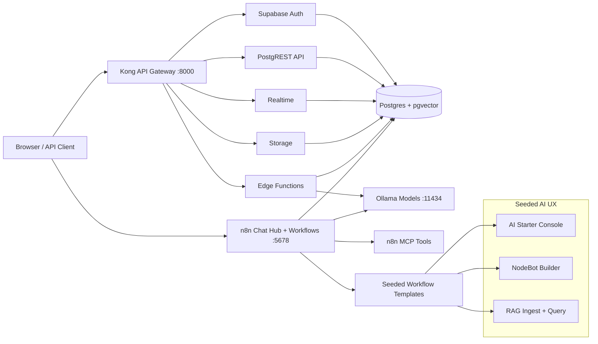

# Supabase AI Starter Kit

> **A local-first, self-hosted AI application stack you can clone, run, and ship from.**

Build real AI apps without spending the first few weeks wiring together auth, Postgres, vector search, workflow automation, local models, edge functions, gateway routing, seed data, tests, and deployment scripts.

This repo gives you a batteries-included Supabase + n8n + Ollama foundation that runs locally, ships as Docker Compose, and is designed to grow into a real product instead of staying a throwaway demo.


[](https://github.com/fletchertyler914/supabase-ai-starter-kit/actions/workflows/ci.yml)
[](https://codespaces.new/fletchertyler914/supabase-ai-starter-kit)

**Infrastructure as code. Everything in Docker. No required SaaS dependencies.**

## What This Is

The Supabase AI Starter Kit is a complete local AI product stack:

- **Supabase self-hosted** for Auth, Postgres, pgvector, Realtime, Storage, and Edge Functions.
- **Kong** as the API gateway in front of the Supabase services.
- **n8n** for visual workflow automation, seeded AI agents, and workflow templates.
- **Ollama** for local chat and embedding models.
- **Docker Compose** for repeatable local development, demos, and single-server deployment.
- **Validation scripts and CI** so you know the stack still works after you change it.

The goal is simple: skip the infrastructure tax and start building the actual AI product.

## The Wow Moment

Run setup:

```bash
git clone https://github.com/fletchertyler914/supabase-ai-starter-kit.git
cd supabase-ai-starter-kit
npm run setup
```

Then open [n8n](http://localhost:5678), go to **Chat -> Workflow agents -> AI Starter Console**, and ask what is available.

Try **NodeBot Builder** next:

```text
Create a webhook workflow at path lead-capture that accepts JSON and returns a normalized response.
```

You should get a real n8n workflow URL back in chat. Describe the automation, let the local agent build it, then inspect and extend it in n8n.

## Who This Is For

This kit is for builders who want ownership of the AI application stack without starting from an empty Docker file:

- **Indie hackers and founders** validating AI product ideas before committing to managed infrastructure.
- **AI consultants and agencies** who need a repeatable client starter stack for auth, RAG, workflows, and automation.
- **Backend and full-stack developers** who want Supabase, n8n, pgvector, and local models working together on day one.
- **Teams evaluating self-hosted AI infrastructure** before choosing what stays local, what moves to a VPS, and what deserves managed services.
- **Privacy-conscious builders** who want to prototype with local data paths and optional hosted model fallback instead of mandatory SaaS calls.

## What This Is Not

- **Not a frontend app template.** There is no polished SaaS UI yet. Bring your own app, or add one under `apps/`.
- **Not a managed cloud platform.** You own the containers, secrets, data, updates, and deployment target.
- **Not a toy chat demo.** The seeded chat flows are there to prove the stack, then give you patterns to extend.
- **Not production-secure by default.** Local defaults are convenient. Regenerate secrets and review deployment docs before exposing anything publicly.

## What You Get

### AI-Ready Backend

- **PostgreSQL + pgvector** for embeddings, semantic search, and RAG.
- **Supabase Auth** with local email testing through Inbucket.
- **PostgREST, Realtime, Storage, and Edge Functions** behind Kong.
- **Supavisor connection pooling** for session and transaction pool access.
- **Logflare-backed analytics service** for Supabase logs.

### Seeded AI Workflows

- **AI Starter Console** - Chat Hub workflow agent that tours the stack, checks status, and points you to the right template.
- **NodeBot Builder** - Describe a workflow in chat and let n8n build it using 11 focused helper sub-workflows plus instance-level MCP.
- **Local Ollama Chat** - Streaming chat with your local model.
- **Document Ingest + Query** - RAG webhooks backed by pgvector and `nomic-embed-text`.
- **Starter Kit Index** - JSON catalog endpoint for templates, helper workflows, URLs, and next steps.
- **AI call telemetry** - `ai_calls` table, daily stats view, and a seeded helper workflow for recording usage.

### Developer Experience

- **One-command setup** that generates `.env`, starts Docker, seeds workflows, configures MCP, pulls models, validates the stack, and opens n8n.
- **17 seeded n8n workflows**: 6 user-facing templates plus 11 builder helpers.
- **Test suite** for health, auth, database integration, workflow JSON, RAG, templates, builder readiness, and Ollama.
- **Cloudflare Tunnel script** for quick public demos.
- **Codespaces/devcontainer support** for repo evaluation.
- **Backup, restore, reset, and upgrade-check scripts** for real development loops.

## Quick Start

```bash
npm run setup
```

That interactive wizard:

- Checks Docker and detects Ollama on the host or in Docker.
- Generates `.env` from `.env.example` if needed.
- Pulls the chat model (`llama3.2:3b`, about 2 GB) and the builder model (`OLLAMA_BUILDER_MODEL`, also `llama3.2:3b` by default).
- Starts the full stack.
- Seeds Chat Hub agents and 17 n8n workflows.
- Issues an n8n MCP access token after your first n8n owner account exists.
- Runs the validation suite.
- Opens n8n in your browser.

See [QUICKSTART.md](./QUICKSTART.md) for the non-dev walkthrough, [EXTENDING.md](./EXTENDING.md) for adding workflows and integrations, and [DEPLOY.md](./DEPLOY.md) for deployment options.

### Manual Start

```bash
cp .env.example .env
npm run dev:full           # base + dev + email + S3 (MinIO)
# or: npm start            # base stack only (host Ollama expected)
```

Without a `--cpu` or `--gpu-*` flag, the kit expects Ollama to already be running on the host at `http://host.docker.internal:11434`. To run Ollama in Docker instead:

```bash
./scripts/start.sh --cpu
./scripts/start.sh --gpu-nvidia
./scripts/start.sh --gpu-amd
```

## Architecture


```mermaid
flowchart LR
  user[Browser / API Client] --> kong[Kong API Gateway :8000]
  user --> n8n[n8n Chat Hub + Workflows :5678]

  kong --> auth[Supabase Auth]
  kong --> rest[PostgREST API]
  kong --> realtime[Realtime]
  kong --> storage[Storage]
  kong --> functions[Edge Functions]

  auth --> db[(Postgres + pgvector)]
  rest --> db
  realtime --> db
  storage --> db
  functions --> db
  functions --> ollama[Ollama Models :11434]

  n8n --> db
  n8n --> ollama
  n8n --> mcp[n8n MCP Tools]
  n8n --> templates[Seeded Workflow Templates]

  subgraph Seeded AI UX
    console[AI Starter Console]
    builder[NodeBot Builder]
    rag[RAG Ingest + Query]
  end

  templates --> console
  templates --> builder
  templates --> rag
```

## Service URLs

| Service | URL | Purpose |
| --- | --- | --- |
| Kong API Gateway | [localhost:8000](http://localhost:8000) | Main API entry point for Supabase services |
| Supabase Studio | [localhost:8000](http://localhost:8000) | DB/auth/storage UI through Kong basic auth |
| n8n Workflows | [localhost:5678](http://localhost:5678) | Visual AI workflow automation and Chat Hub |
| Analytics | [localhost:4000](http://localhost:4000) | Logflare logs UI |
| Email (dev) | [localhost:9000](http://localhost:9000) | Inbucket web UI with `npm run dev:email` |
| MinIO console | [localhost:9101](http://localhost:9101) | S3-compatible storage console with `npm run dev:s3` |
| Postgres pooler | `localhost:5432` | Supavisor session pool |
| Postgres txn | `localhost:6543` | Supavisor transaction pool |

## Templates

User-facing templates live in [`templates/README.md`](./templates/README.md):

| Template | Trigger | What it does |
| --- | --- | --- |
| Local Ollama Chat | LangChain chat webhook | Streaming chat with your local Ollama model |
| Supabase API Health Check | `POST /webhook/template-supabase-health` | Verifies Kong/Auth health from inside Docker |
| NodeBot Builder | Chat Hub workflow agent | Conversationally builds, lists, and manages n8n workflows |
| Document Ingest + Query | `template-rag-ingest` / `template-rag-query` | RAG with pgvector and Ollama embeddings |
| AI Starter Console | Chat Hub workflow agent | Guided tour, status, and template launcher |
| Starter Kit Index | `GET /webhook/template-kit-index` | JSON catalog of templates, helpers, and URLs |

Builder helper sub-workflows are called internally by NodeBot Builder:

| Helper | Pattern |
| --- | --- |
| `SK - Create Greeting Workflow` | Manual Trigger + Set greeting |
| `SK - Create Webhook Workflow` | POST webhook + normalized JSON response |
| `SK - Create Scheduled Workflow` | Schedule Trigger + Set log |
| `SK - Create RAG Workflow` | RAG ingest + query webhooks |
| `SK - List / Update / Activate / Delete Workflow` | Workflow management |
| `SK - Create Supabase Row Trigger Workflow` | Postgres row-change trigger |
| `SK - Starter Kit Status` | Read-only stack readiness summary |
| `SK - Record AI Call` | Observability insert into `ai_calls` |

## Development Workflow

```bash
# Setup / lifecycle
npm run setup                    # interactive wizard
npm start                        # smart starter with host Ollama expected
npm stop                         # docker compose down
npm run restart                  # docker compose restart
npm run reset                    # interactive teardown
npm run tunnel                   # Cloudflare Tunnel public URL

# Compose modes
npm run dev                      # base + docker/docker-compose.dev.yml
npm run dev:email                # base + Inbucket
npm run dev:s3                   # base + MinIO
npm run dev:full                 # base + dev + email + S3

# Utilities
npm run logs                     # docker compose logs -f
npm run db:connect               # psql shell inside supabase-db
npm run kong:open                # http://localhost:8000
npm run n8n:open                 # http://localhost:5678
npm run email:open               # http://localhost:9000
npm run minio:open               # http://localhost:9101
```

## Testing and Validation

```bash
npm test                         # health + auth + db + templates + rag + ollama
npm run health                   # service health check
npm run test:auth                # full signup/signin/confirmation flow
npm run test:db                  # schemas, extensions, JWT, pgvector, roles
npm run test:templates           # import + workflow shape checks + webhook smoke test
npm run test:rag                 # RAG ingest + query end-to-end
npm run test:builder             # n8n MCP + NodeBot Builder readiness
npm run test:builder:e2e         # builder workflow smoke test
npm run test:edge                # edge function smoke tests
npm run test:ollama              # n8n -> Ollama chat webhook end-to-end
npm run validate:workflows       # workflow JSON seed validation
npm run verify                   # CI-like local verification pipeline
```

The GitHub Actions workflow runs the full-stack validation path so template, database, and workflow changes are caught before release.

## Configuration

Key settings live in `.env` and are documented in [`.env.example`](./.env.example).

```bash
# Secrets - regenerate before any non-local use
POSTGRES_PASSWORD=your-super-secret-and-long-postgres-password
JWT_SECRET=your-super-secret-jwt-token-with-at-least-32-characters-long
ANON_KEY=...
SERVICE_ROLE_KEY=...
DASHBOARD_USERNAME=supabase
DASHBOARD_PASSWORD=change-me
SECRET_KEY_BASE=...
VAULT_ENC_KEY=...

# n8n
N8N_ENCRYPTION_KEY=super-secret-key
N8N_USER_MANAGEMENT_JWT_SECRET=even-more-secret
N8N_BASIC_AUTH_ACTIVE=true
N8N_BASIC_AUTH_USER=admin
N8N_BASIC_AUTH_PASSWORD=changeme

# Ollama and optional hosted fallback
OLLAMA_BASE_URL=http://ollama:11434
OLLAMA_DEFAULT_MODELS=llama3.2:3b,nomic-embed-text
OLLAMA_BUILDER_MODEL=llama3.2:3b
OLLAMA_CHAT_FALLBACK_PROVIDER=
OPENAI_API_KEY=
OPENAI_CHAT_MODEL=gpt-4o-mini

# n8n instance-level MCP, auto-managed by setup
N8N_MCP_MANAGED_BY_ENV=true
N8N_MCP_ACCESS_ENABLED=true
N8N_MCP_ACCESS_TOKEN=
```

Generate strong JWT keys with the [Supabase self-hosting guide](https://supabase.com/docs/guides/self-hosting/docker#generate-api-keys).

## What You Can Build

- **AI support or internal knowledge bots** with auth, conversation storage, vector search, and workflow orchestration.
- **Document analysis pipelines** with file upload, background processing, embeddings, and semantic query APIs.
- **Lead intake and enrichment workflows** that accept webhooks, normalize payloads, call models, and write to Postgres.
- **Content generation systems** with approval workflows, versioned records, and storage.
- **Private RAG systems** where data, embeddings, and workflows stay on infrastructure you control.

## Deployment Path

This repo is Compose-first:

- **Local development** with Docker and optional Inbucket/MinIO overlays.
- **Public demos** with `npm run tunnel` and Cloudflare Tunnel.
- **Single-server deployment** on a VPS or Coolify using the same base structure.
- **Hybrid cloud** by keeping the stack local/self-hosted while adding hosted model providers only where useful.

Read [DEPLOY.md](./DEPLOY.md) before exposing services publicly. Local defaults are built for fast iteration, not public security.

## Roadmap

Near-term follow-ups:

- Add a tiny optional app under `apps/web/` that demonstrates login, chat, and RAG query against the seeded stack.
- Add a visual observability dashboard on top of `ai_calls` and `ai_call_daily_stats`.
- Add one real-world integration template such as Slack or Discord RAG Q&A.
- Add a builder eval harness that prompts NodeBot Builder with known requests and verifies the expected helper/tool path.
- Continue tightening public launch assets, docs, and release hygiene.

## Documentation

- [QUICKSTART.md](./QUICKSTART.md) - Non-dev walkthrough.
- [EXTENDING.md](./EXTENDING.md) - Add workflows, agents, edge functions, and integrations.
- [DEPLOY.md](./DEPLOY.md) - Cloudflare Tunnel, Coolify/VPS, Fly.io, and hybrid cloud notes.
- [UPGRADING.md](./UPGRADING.md) - Upgrade and migration notes.
- [scripts/README.md](./scripts/README.md) - Setup, tunnel, testing, health, reset, backup, and restore utilities.
- [templates/README.md](./templates/README.md) - User-facing templates and builder helper workflows.
- [n8n/README.md](./n8n/README.md) - n8n seed data, credentials, and import behavior.
- [docs/public-launch-checklist.md](./docs/public-launch-checklist.md) - Repo launch checklist and demo asset notes.

Upstream docs:

- [Self-hosting Supabase](https://supabase.com/docs/guides/self-hosting/docker)
- [n8n self-hosted](https://docs.n8n.io/hosting/)
- [Kong declarative config](https://docs.konghq.com/gateway/latest/production/deployment-topologies/db-less-and-declarative-config/)
- [pgvector](https://github.com/pgvector/pgvector)
- [Ollama](https://ollama.com/)

## Troubleshooting

**Services not starting?**

```bash
docker compose ps
docker compose logs -f
./scripts/reset.sh && docker compose up -d
```

**Authentication failing?**

```bash
npm run test:auth
open http://localhost:9000
curl -H "apikey: $ANON_KEY" http://localhost:8000/auth/v1/health
```

**n8n workflows not working?**

```bash
docker compose restart n8n
docker compose logs -f n8n
npm run n8n:open
```

**Port conflicts when running `dev:full`?**

The S3 overlay remaps MinIO to host ports `9100` (API) and `9101` (console) so it can coexist with the Inbucket email overlay on port `9000`. Inside the Docker network, MinIO is still reachable at `http://minio:9000`.

## Contributing

Pull requests and issues are welcome. Start with [CONTRIBUTING.md](./CONTRIBUTING.md), use the GitHub issue templates, and run the validation commands before opening a PR.

For security-sensitive reports, see [SECURITY.md](./SECURITY.md). For release notes, see [CHANGELOG.md](./CHANGELOG.md).

## Built By

Built by [Tyler Fletcher](https://github.com/fletchertyler914) for builders who would rather ship AI products than babysit infrastructure glue.

If this saves you setup time, star the repo, open an issue with what broke, or share what you build with it.

## License

This project is licensed under the Apache License 2.0. See [LICENSE](LICENSE) for details.
