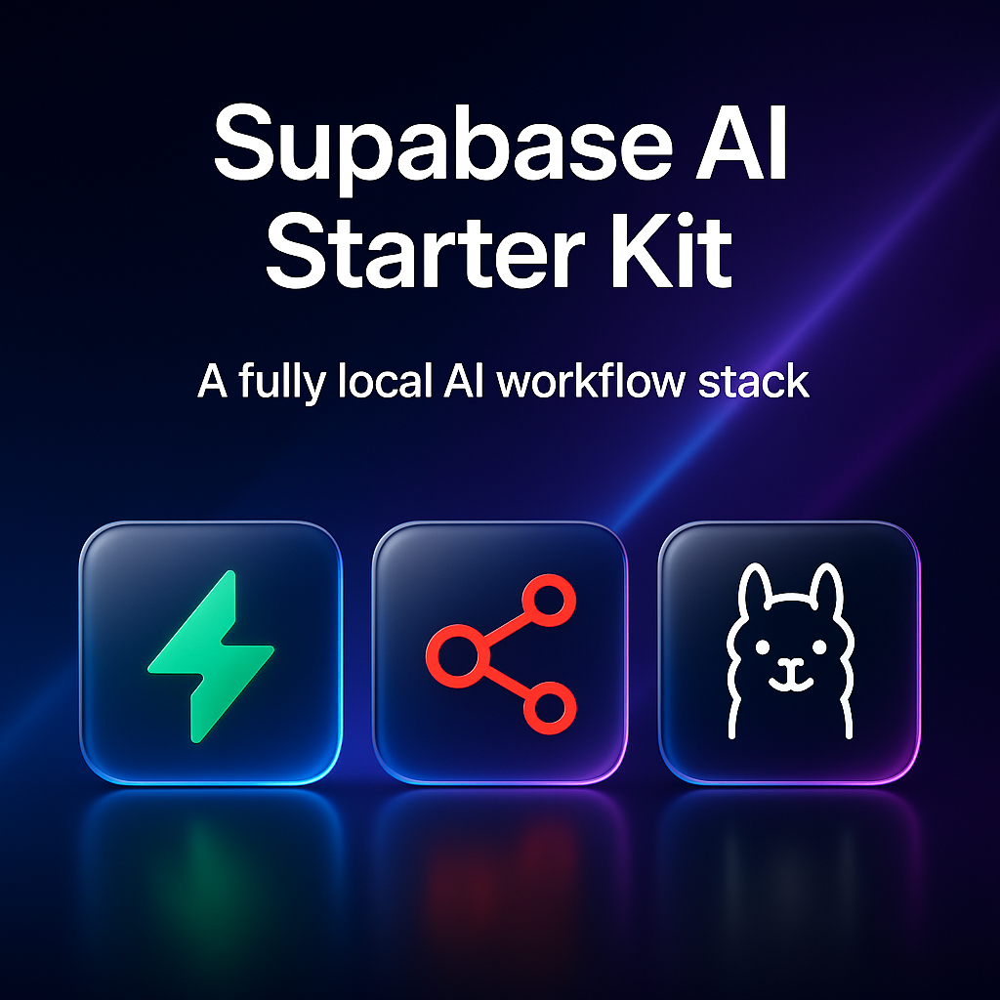

# Supabase AI Starter Kit

> **Build AI that scales. Ship in a weekend, iterate forever.**

An open-source Docker Compose template that gets you from idea to AI-powered app in minutes, not months. Built for the builders, hackers, and 100x developers who move fast and ship things.


Inspired by the [n8n AI starter kit](https://github.com/n8n-io/self-hosted-ai-starter-kit), but supercharged with Supabase's complete backend platform.

## What's included

✅ **[Supabase](https://supabase.com/)** - PostgreSQL + Auth + Realtime + Edge Functions + pgvector  
✅ **[n8n](https://n8n.io/)** - Visual workflow automation with 400+ integrations  
✅ **[Ollama](https://ollama.com/)** - Local LLMs that actually work in production  
✅ **Pre-built AI chatbots** - Ready to use, zero configuration required

## What you can build

⭐️ **AI-powered customer support** with your company docs  
⭐️ **Smart document processing** workflows that never leak data  
⭐️ **Local RAG systems** with vector search and semantic retrieval  
⭐️ **Automated content generation** pipelines for marketing teams

## 🚀 Common Commands

**Start (choose your setup):**

```bash
# Ollama modes
./start.sh                              # Host machine Ollama (fastest for Mac/Apple Silicon)
./start.sh --cpu                        # Containerized CPU Ollama
./start.sh --gpu-nvidia                 # Containerized NVIDIA GPU Ollama
./start.sh --gpu-amd                    # Containerized AMD GPU Ollama

# With email server for auth testing
./start.sh --dev-email                  # Host Ollama + email server
./start.sh --cpu --dev-email            # CPU Ollama + email server
./start.sh --gpu-nvidia --dev-email     # NVIDIA GPU Ollama + email server
./start.sh --gpu-amd --dev-email        # AMD GPU Ollama + email server

# Background mode (detached)
./start.sh --detach                     # Host Ollama and run everything in background
./start.sh --cpu --detach               # CPU Ollama in background
./start.sh --gpu-nvidia --detach        # NVIDIA GPU Ollama in background
./start.sh --gpu-amd --detach           # AMD GPU Ollama in background

# Full combinations
./start.sh --gpu-nvidia --dev-email --detach  # NVIDIA + email + background
./start.sh --gpu-amd --dev-email --detach     # AMD + email + background
./start.sh --cpu --dev-email --detach         # CPU + email + background
```

**Reset (cleanup options):**

```bash
./reset.sh                              # Standard reset (keep Ollama models)
./reset.sh --clear-ollama               # Nuclear option (remove everything)
./reset.sh --dev-email                  # Include email server cleanup
./reset.sh --clear-ollama --dev-email   # Full cleanup including email server
```

**Stop:**

```bash
docker compose down                     # Stop all services gracefully
```

## Installation & Quick Start

**Zero-config startup in 60 seconds** ⚡

### 1. Clone the Repository

```bash
git clone https://github.com/fletchertyler914/supabase-ai-starter-kit.git
cd supabase-ai-starter-kit
```

### 2. Start Everything

**With external Ollama (fastest for Mac/Apple Silicon):**

```bash
./start.sh                    # Expects Ollama running on host
```

**With containerized Ollama:**

```bash
./start.sh --cpu              # CPU-only container
./start.sh --gpu-nvidia       # NVIDIA GPU container
./start.sh --gpu-amd          # AMD GPU container
```

**With email testing:**

```bash
./start.sh --dev-email --gpu-nvidia
```

> [!NOTE]
> For NVIDIA GPU users: If you haven't used your GPU with Docker before, follow the [Ollama Docker instructions](https://github.com/ollama/ollama/blob/main/docs/docker.md) first.

### 3. For Mac / Apple Silicon Users

Macs can't expose GPU to Docker containers, so you have two options:

**Option 1: External Ollama (Recommended - faster performance)**

First, install Ollama locally:

```bash
# Install Ollama
curl -fsSL https://ollama.com/install.sh | sh

# Start Ollama and pull models
ollama serve &
ollama pull llama3.2:1b
ollama pull nomic-embed-text
```

Then start the kit (uses external Ollama):

```bash
export OLLAMA_HOST=host.docker.internal:11434
./start.sh                    # External Ollama mode
./start.sh --dev-email        # With email server
```

**Option 2: Containerized CPU Ollama (Simpler but slower)**

```bash
./start.sh --cpu              # Containerized CPU Ollama
./start.sh --cpu --dev-email  # With email server
```

<details>
<summary><strong>🔧 Advanced: Direct Docker Compose Commands</strong></summary>

If you prefer the traditional approach:

```bash
# CPU only
docker compose --profile cpu up

# NVIDIA GPU
docker compose --profile gpu-nvidia up

# AMD GPU
docker compose --profile gpu-amd up

# With email server
docker compose -f docker-compose.yml -f docker-compose.email.yml --profile cpu up
```

</details>

## ⚡️ Quick start and usage

After completing the installation steps above, follow these steps to get started:

1. **Open [http://localhost:5678/](http://localhost:5678/)** in your browser to set up n8n. You'll only have to do this once.
2. **Navigate to the included workflows** - they're automatically imported and activated
3. **Click the direct chat link** to start using the AI chatbot immediately:
   - **NodeBot**: [http://localhost:5678/webhook/ba65d0a2-7d1d-4efe-9e7a-c41b1031e3bb/chat](http://localhost:5678/webhook/ba65d0a2-7d1d-4efe-9e7a-c41b1031e3bb/chat)
4. **If this is your first time**, you may need to wait while Ollama downloads the `llama3.2:1b` model. You can inspect the Docker console logs to check progress.

To open n8n at any time, visit [http://localhost:5678/](http://localhost:5678/) in your browser.

With your n8n instance, you'll have access to over 400 integrations and a suite of basic and advanced AI nodes such as [AI Agent](https://docs.n8n.io/integrations/builtin/cluster-nodes/root-nodes/n8n-nodes-langchain.agent/), [Text classifier](https://docs.n8n.io/integrations/builtin/cluster-nodes/root-nodes/n8n-nodes-langchain.text-classifier/), and [Information Extractor](https://docs.n8n.io/integrations/builtin/cluster-nodes/root-nodes/n8n-nodes-langchain.information-extractor/) nodes. To keep everything local, just remember to use the Ollama node for your language model and PostgreSQL with pgvector for embeddings.

## What you get out of the box

### 🤖 **Instant AI Chatbots**

Pre-built workflows that work immediately:

- **"NodeBot"** - A technical AI assistant pre-trained on Supabase, n8n, and Ollama workflows
- soon™️...

> ✨ **Workflows are automatically activated!**
> The chat links work immediately after startup.

> ✨ **Workflow changes auto-save!** Modify workflows in the n8n UI and they are stored in supabase under the `n8n` schema.

### ⚡ **Vector Search Ready**

PostgreSQL with pgvector extension pre-configured. No setup, no fuss:

```sql
-- Create your table
CREATE TABLE documents (
  id SERIAL PRIMARY KEY,
  content TEXT,
  embedding VECTOR(1536),
  metadata JSONB DEFAULT '{}'
);

-- Search semantically
SELECT content, cosine_similarity(embedding, '[...]'::vector) as similarity
FROM documents
ORDER BY embedding <=> '[...]'::vector
LIMIT 5;
```

### 🔐 **Auth & Realtime Built-in**

User management, real-time subscriptions, and APIs auto-generated. Because life's too short to build auth from scratch.

## Key Differentiators

| Feature                | n8n Starter Kit | Supabase AI Starter Kit                |
| ---------------------- | --------------- | -------------------------------------- |
| **Vector Storage**     | Qdrant          | PostgreSQL + pgvector                  |
| **Authentication**     | ❌              | ✅ Built-in auth with social providers |
| **Real-time Features** | ❌              | ✅ WebSocket subscriptions             |
| **Edge Functions**     | ❌              | ✅ Serverless TypeScript functions     |
| **Database Admin**     | ❌              | ✅ Supabase Studio interface           |
| **Email Testing**      | ❌              | ✅ Local email server for dev          |
| **Pre-built Chatbots** | ❌              | ✅ Working chatbot out of the box      |

## 🔧 For the Tinkerers

### Email Testing Server

Test authentication flows with a local email server:

```bash
./start.sh --dev-email
```

Access the email interface at [localhost:9000](http://localhost:9000) to view OTP emails and auth flows.

### Adding More Ollama Models

**Before starting containers** (add to `.env` file):

```bash
# Comma-separated list of models to pull automatically
# Default: llama3.2:1b,nomic-embed-text
OLLAMA_DEFAULT_MODELS=llama3.2:1b,nomic-embed-text,llama3.2:3b,codellama:7b
```

**After containers are running:**

```bash
# Pull additional models manually
docker exec ollama-cpu ollama pull llama3.2:3b
docker exec ollama-cpu ollama pull codellama:7b

# Or for GPU containers
docker exec ollama-gpu ollama pull llama3.2:3b

# List available models
docker exec ollama-cpu ollama list
```

## Upgrading

**Simple two-step upgrade:**

```bash
# Step 1: Reset to clean state
./reset.sh

# Step 2: Start with latest images
./start.sh --gpu-nvidia  # or --cpu, --gpu-amd, etc.
```

**That's it!** The reset pulls fresh images automatically.

<details>
<summary><strong>🔧 Advanced: Manual Docker Compose Upgrade</strong></summary>

```bash
# Pull latest images first
docker compose --profile gpu-nvidia pull

# Recreate and start
docker compose create && docker compose --profile gpu-nvidia up
```

</details>

## Troubleshooting

**Workflows appear inactive?** If imported workflows don't activate automatically:

```bash
# Manually activate all workflows
docker exec n8n n8n update:workflow --all --active=true

# Then restart the container
docker compose restart n8n
```

**Need a clean slate?** Reset everything with one command:

```bash
# Standard reset (preserves Ollama models)
./reset.sh

# Nuclear option (removes everything including models)
./reset.sh --clear-ollama

# Include email server cleanup
./reset.sh --dev-email

# See all options
./reset.sh --help
```

**After reset, restart with your preferred setup:**

```bash
./start.sh --gpu-nvidia --dev-email  # or your preferred flags
```

**Chat links not working?** Make sure you've completed the initial n8n setup at [http://localhost:5678/](http://localhost:5678/) first.

> [NOTE]
> This starter kit is designed to help you get started with self-hosted AI workflows. While it's not fully optimized for production environments, it combines robust, battle-tested components that work well together for proof-of-concept projects and rapid prototyping. You can customize it to meet your specific needs.

## Services

| Service             | URL                                       | Purpose                             |
| ------------------- | ----------------------------------------- | ----------------------------------- |
| **Supabase Studio** | [localhost:3000](http://localhost:3000)   | Database admin & project management |
| **n8n**             | [localhost:5678](http://localhost:5678)   | Workflow builder                    |
| **AI Chatbots**     | Direct webhook URLs                       | Ready-to-use conversational AI      |
| **Email Testing**   | [localhost:9000](http://localhost:9000)\* | Local email server for auth flows   |

\*Only available with `--dev-email` flag

## 📜 License

This project is licensed under the Apache License 2.0 - see the [LICENSE](LICENSE) file for details.

## Why This Exists

Every weekend warrior and side-project hero has been there: you have a brilliant AI idea, but you spend 6 hours wrestling with Docker configs instead of building. This starter kit is for the builders who want to spend their time creating, not configuring.

**What would you build if setup took 60 seconds instead of 6 hours?**

## Contributing

**We'd love your help making this even better!** 🙌

- **Found a bug?** [Open an issue](https://github.com/fletchertyler914/supabase-ai-starter-kit/issues)
- **Have an idea?** [Start a discussion](https://github.com/fletchertyler914/supabase-ai-starter-kit/discussions) or submit a PR
- **Built something cool?** Share your workflows and demos
- **Improved the docs?** Documentation PRs are always welcome

Whether you're fixing typos, adding features, or sharing workflows - every contribution makes this better for the community.

## Community & Support

Built with ❤️ by developers, for developers.

- **Issues & Questions**: [GitHub Issues](https://github.com/fletchertyler914/supabase-ai-starter-kit/issues)
- **Supabase Community**: [Discord](https://discord.supabase.com/)
- **n8n Community**: [Forum](https://community.n8n.io/)
